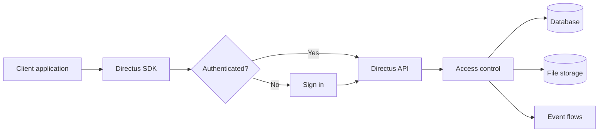
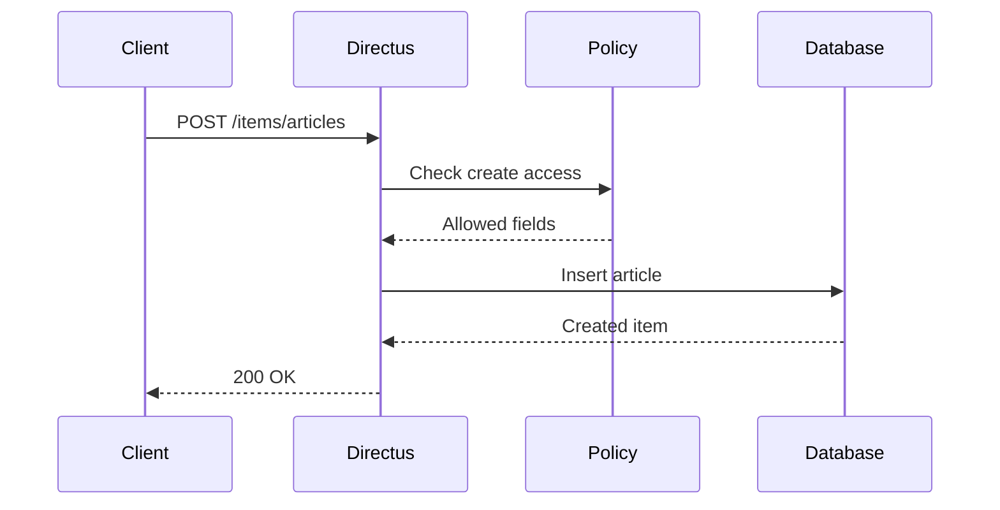
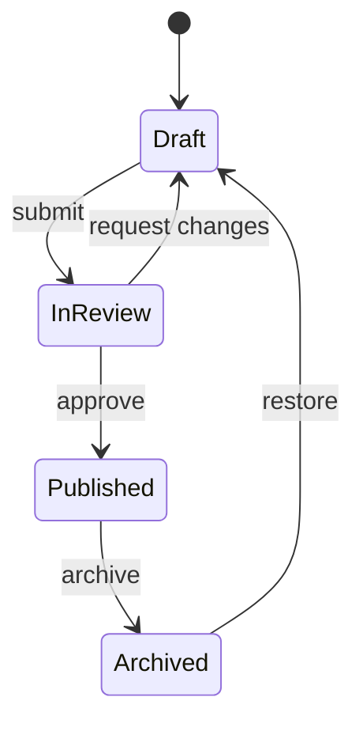
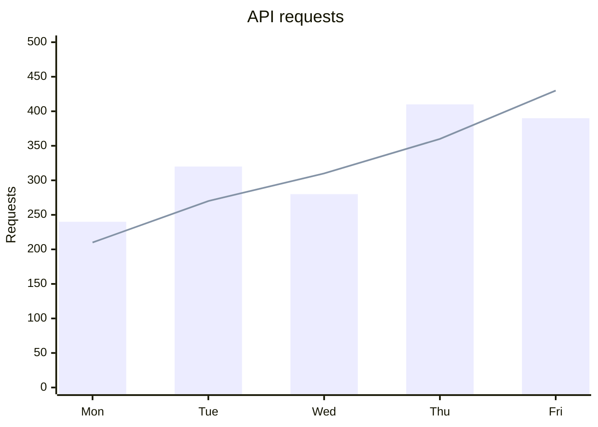

Use the toolbar to zoom, reset the view, or download each diagram as PNG or SVG. Drag the canvas to pan. With the canvas focused, use the arrow keys to pan, `+` and `-` to zoom, and `0` to reset.

## Flowchart

::mermaid{title="Directus request flow" filename="directus-request-flow"}

::

## Sequence diagram

::mermaid{title="Item creation" filename="item-creation"}

::

## State diagram

::mermaid{title="Content workflow" filename="content-workflow"}

::

## XY chart

Hover over the bars or line points to test interactive tooltips.

::mermaid{title="API requests" filename="api-requests"}

::
